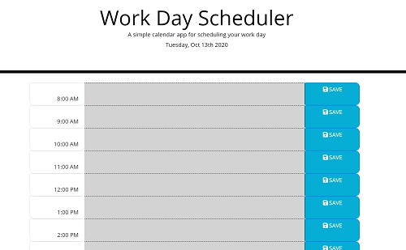

# Work Day Calendar

## Uses

Use this calendar to plan out your day every morning or set daily events and reminders.

## Benefits

The calendar tells you the current date and color-codes your hours based on what's in the past and what's in the future. This allows an easy way to see what's coming up at-a-glance.

## Experience

Each hour is large enough to read and easy to distinguish. It should look like this!

